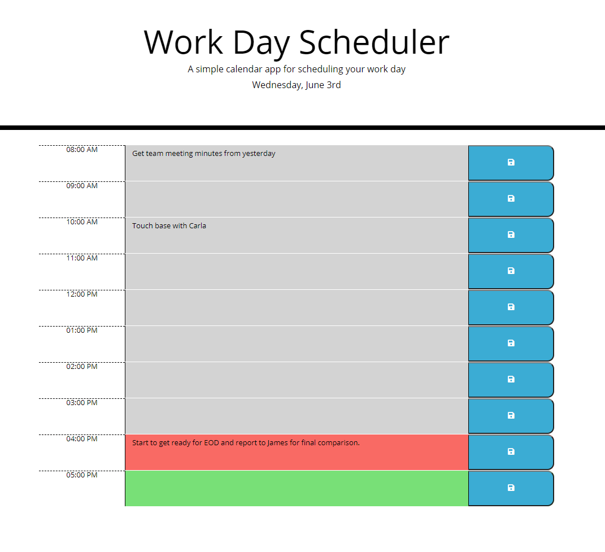

# Work Day Scheduler
Work day scheduler is a single day planner in which you can plan your day in hour increments. Powered by Javascript & JQuery, styling by Bootstrap. Visual cues help to keep your eyes trained on what time it is, visual cues update every 15 minutes. Accidently close the tab? No worries! Just open the page up again and you will see everything up to your last save. 

## Deployment
Live page at: [https://beki-g.github.io/workDayScheduler/](https://beki-g.github.io/workDayScheduler/)

> Screenshot of working Scheduler 

## Built with:
- Javascript
- JQuery
- Bootstrap
- HTML
- CSS

## Author
Myself, [Beki](https://github.com/Beki-G)